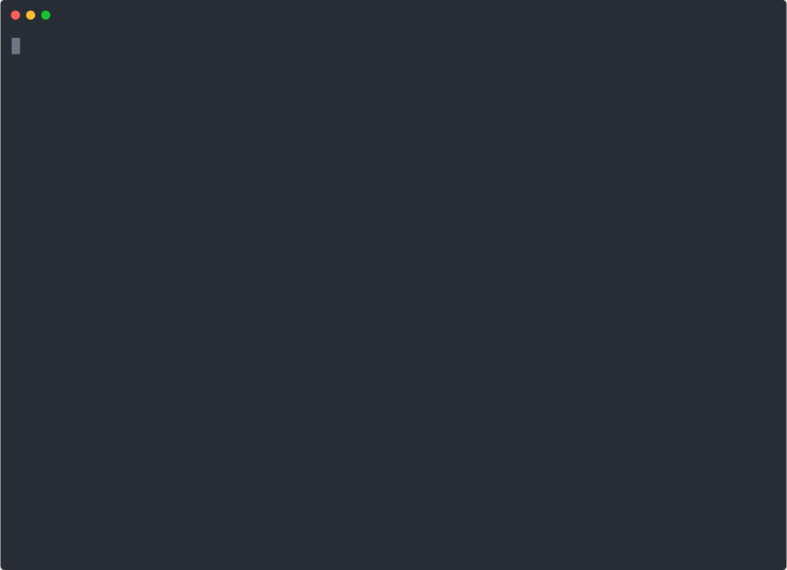

# Software Office

Turn your Claude Code session into a small, organized software office.
**11 agents. 20 slash commands. A simple Agile team. Multilingual.**

> Inspired by Claude Code Game Studios + BMAD-METHOD, targeted at general
> software development. Agents detect your language and respond in it.

## ▶ Demo



A 30-second walk-through: `/start` → `/idea` → `/architecture` →
`/develop-story` → `/code-review`. The team picks the right agent at each
step, applies quality bars (security/performance/tests), and lets you
approve every change.

---

## Table of Contents

1. [What It Does](#what-it-does)
2. [Installation](#installation)
3. [How It Works](#how-it-works)
4. [The Team](#the-team)
5. [Slash Commands](#slash-commands)
6. [A Typical Workflow](#a-typical-workflow)
7. [Folder Layout](#folder-layout)
8. [Collaboration Protocol](#collaboration-protocol)
9. [Multilingual](#multilingual)
10. [Customization](#customization)

---

## What It Does

A single Claude session is powerful but unstructured. Nobody asks "do we
really need this?", nobody enforces code review, nobody catches when you
skip tests.

**Software Office** gives Claude a small team structure:

- **Decision makers** (Directors): vision and technical quality
- **Implementers** (Leads): code structure, UX, quality
- **Doers** (Specialists): backend, frontend, devops code

You still make every decision — but inside a team that asks the right
questions, knows its boundaries, and consults each other.

---

## Installation

**One file: `software-office-install.bat`**

1. Copy the `.bat` into your project's **root folder**
2. Double-click
3. Type `e` and Enter (Turkish for "yes" — works for confirmation)
4. Done — you can delete the `.bat`

The `.bat` carries 10 agents, 19 commands, docs and settings embedded.
No external dependencies. Drop it on a USB stick, email it, run on any
Windows machine (PowerShell ships with Windows).

After install, in the project folder:

```bash
claude
/start
```

If you're installing into an **existing project** with prior AI context
(context.md, .cursorrules, etc.):

```bash
claude
/takeover    # imports prior context into our memory
/start       # then proceeds normally
```

---

## How It Works

Software Office is built on three systems:

### 1. Slash Commands (`/command`)

Each `.md` file in `.claude/commands/` is a slash command.
Type `/` in chat, autocomplete shows them.

Command file structure:

```markdown
---
description: "What this does and when it triggers"
allowed-tools: Read, Write, ...
---

[Instructions Claude follows when this command runs]
```

When you call a command, Claude reads the body as a task description
and follows the steps. Most commands start with "engage [agent]".

### 2. Agents (Subagents)

Each `.md` file in `.claude/agents/` is a specialized subagent.
Each knows its domain and its boundaries.

Agent file structure:

```markdown
---
name: agent-name
description: "When to use this agent"
tools: Read, Write, Edit, ...    # accessible tools
model: opus / sonnet              # model assignment
---

[Agent's system prompt — responsibilities, rules, boundaries]
```

When a command says "engage agent-name", Claude loads that agent's
system prompt and works from its perspective. The agent stays in its
sandbox — e.g. `backend-developer` doesn't touch UI files.

### 3. CLAUDE.md and Configuration

`CLAUDE.md` (in project root) **auto-loads every session**:

- Tech stack
- Folder layout
- Collaboration protocol
- Coding standards (loaded via `@` references)
- Project memory (loaded via `@.claude/memory/*.md`)

So Claude enters every session knowing how this project works.

`.claude/settings.json` controls permissions: which commands auto-allow,
which are forbidden (`rm -rf` blocked, `.env` reads blocked).

---

## The Team

```
Directors (Opus)
├── tech-director         → architecture, tech selection, technical conflicts
└── product-manager       → scope, priority, product decisions

Leads (Sonnet, security-reviewer Opus)
├── engineering-lead      → code structure, API, code review
├── qa-lead               → test strategy, quality gate
├── design-lead           → UX, screen design, user flow
├── business-analyst      → requirements, existing system analysis, process
├── scrum-master          → sprint, standup, retro, backlog management
└── security-reviewer     → STRIDE threat model, OWASP audit, compliance

Specialists (Sonnet)
├── backend-developer     → APIs, services, DB, business logic
├── frontend-developer    → UI components, screens
└── devops                → CI/CD, deployment, environments
```

### How the Hierarchy Works

- **Vertical delegation**: Director → Lead → Specialist. Directors don't
  delegate directly to specialists (they go through leads).
- **Horizontal consultation**: Same-tier agents consult but don't decide.
  Backend ↔ Frontend talk about API contract, but architectural decisions
  go through engineering-lead.
- **Conflicts**: Design conflicts → product-manager.
  Technical conflicts → tech-director.

---

## Slash Commands

| Command | What It Does | Agent |
|---------|--------------|-------|
| **Onboarding** | | |
| `/takeover` | Import existing project context (context.md, .cursorrules, etc.) | — |
| `/start` | Smart: stage + tech stack detection, route | — |
| `/help` | Context-aware suggestion + full command list | — |
| **Design** | | |
| `/idea` | Turn idea into concept doc | product-manager |
| `/analyze` | Requirements / existing system analysis | business-analyst |
| `/architecture` | Technical architecture + ADRs | tech-director |
| **Sprint (Agile)** | | |
| `/create-stories` | Break work into stories | product-manager |
| `/backlog` | Backlog refinement | scrum-master |
| `/sprint-plan` | Sprint planning (capacity + selection) | scrum-master |
| `/standup` | Daily status + blockers | scrum-master |
| `/retro` | Sprint retrospective | scrum-master |
| **Development** | | |
| `/develop-story` | Implement a story end-to-end | backend/frontend |
| `/code-review` | Code quality / architecture / test review | engineering-lead |
| **QA & Security** | | |
| `/qa-plan` | Test plan for sprint or feature | qa-lead |
| `/bug-report` | Structured bug report | qa-lead |
| `/bug-fix` | QA→Dev→QA bug fix loop | bug owner |
| `/security-review` | STRIDE + OWASP Top-10 audit | security-reviewer |
| **Decision / Knowledge** | | |
| `/consult` | Multi-agent parallel consultation (party mode) | (panel) |
| `/memory` | Manage project learnings | — |
| `/release-check` | Pre-release go/no-go checklist | tech-director |

---

## A Typical Workflow

Building a TODO app:

### 1. Concept (`/idea`)
- product-manager: "What problem? Who uses it?"
- You answer, it generates options, you pick
- Output: `docs/product/concept.md`

### 2. Requirements (`/analyze`)
- business-analyst: stakeholder questions, FR/NFR/constraints list
- If existing system: modules, dependencies, impact zones
- Output: `docs/analysis/requirements.md`

### 3. Architecture (`/architecture`)
- tech-director: "Web or mobile? Backend? DB?"
- 2-3 options per section + pros/cons
- Output: `docs/architecture/architecture.md` + `docs/adr/0001-*.md`

### 4. Stories (`/create-stories`)
- product-manager generates story list from architecture
- Output: `production/stories/001-user-login.md`,
  `002-todo-list.md`, `003-todo-add.md`...

### 5. Sprint Plan (`/sprint-plan`)
- scrum-master: capacity + story selection from backlog
- Output: `production/sprints/S01-2026-04-26.md`

### 6. Develop (`/develop-story 001`)
- engineering-lead reads story, routes to right specialist
- backend-developer (e.g.) proposes file list, gets approval
- Code + unit test together
- Test runs, acceptance criteria checked off

### 7. Code Review (`/code-review`)
- engineering-lead checks quality, architecture fit, tests
- Markdown report: APPROVED / REVISION / MAJOR REVISION

### 8. QA (`/qa-plan` + `/bug-report` + `/bug-fix`)
- qa-lead generates test plan
- If bug: structured `/bug-report`, then `/bug-fix` closes the loop

### 9. Standup, Retro, Memory
- `/standup` daily, `/retro` at sprint end
- Lessons go into `.claude/memory/`

### 10. Release (`/release-check`)
- tech-director: code, test, deployment, doc checklist
- Blocking items must pass — otherwise no GO

---

## Folder Layout

```
your-project/
├── CLAUDE.md                       # Auto-loaded each session
├── .claude/
│   ├── settings.json               # Permissions (allow/deny)
│   ├── agents/                     # 10 agent definitions
│   ├── commands/                   # 19 slash commands
│   ├── memory/                     # Accumulated learnings
│   └── docs/                       # Collaboration, coordination, standards
├── src/                            # Source code
├── tests/                          # Tests
├── docs/
│   ├── product/                    # Concept, vision (product-manager)
│   ├── analysis/                   # Requirements, existing system (business-analyst)
│   ├── architecture/               # Architecture (tech-director)
│   ├── adr/                        # Architecture Decision Records
│   └── ux/                         # Screen specs (design-lead)
└── production/
    ├── backlog.md                  # Ordered story list
    ├── stories/                    # Story files
    ├── sprints/                    # Sprint plans (SXX-yyyy-mm-dd.md)
    ├── retros/                     # Retrospectives
    ├── qa/
    │   ├── bugs/                   # Bug reports
    │   └── plan-*.md               # Test plans
    ├── standup-log.md              # Daily status
    └── session-state/
        └── active.md               # Session context
```

---

## Collaboration Protocol

**The user drives. Agents don't go autonomous.**

Each task: **Question → Options → Decision → Draft → Approval**

1. **Question**: agent asks what it doesn't know
2. **Options**: 2-4 alternatives with pros/cons
3. **Decision**: you pick
4. **Draft**: preview of what will be written
5. **Approval**: "May I write this to [path]?" — explicit

Agents stay within their domain. When unsure, they escalate
(specialist → lead → director).

Detail: [.claude/docs/collaboration.md](.claude/docs/collaboration.md)

---

## Multilingual

Each agent has a **Language Protocol** in its system prompt:

> Detect the user's language from their messages and respond in the same language.
> Default: English. Tech terms (API, REST, ADR, Docker, etc.) stay in English.
> Files you write follow the user's language preference.

So whether you write in English, Turkish, German, or Japanese, agents
respond in your language. Code stays in English (industry convention).
Documentation files follow your language.

Tested with: English, Turkish.
Should work with: any language Claude supports.

---

## Customization

This is a **template**, not a locked framework.

- **Add/remove agent**: `.md` file in `.claude/agents/`
- **Add/remove command**: `.md` file in `.claude/commands/`
- **Change agent behavior**: edit the system prompt in its `.md`
- **Tighten/relax rules**: `.claude/docs/coding-standards.md`
- **Permissions**: `.claude/settings.json`

After adding a file, restart your Claude session (so new files load).

---

## License

MIT
